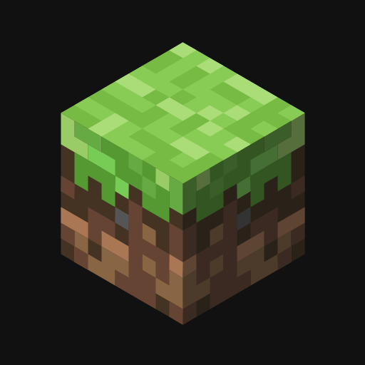
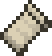
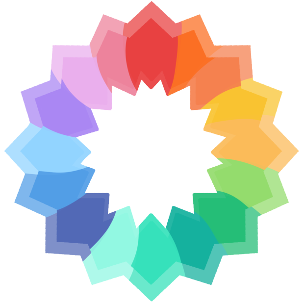
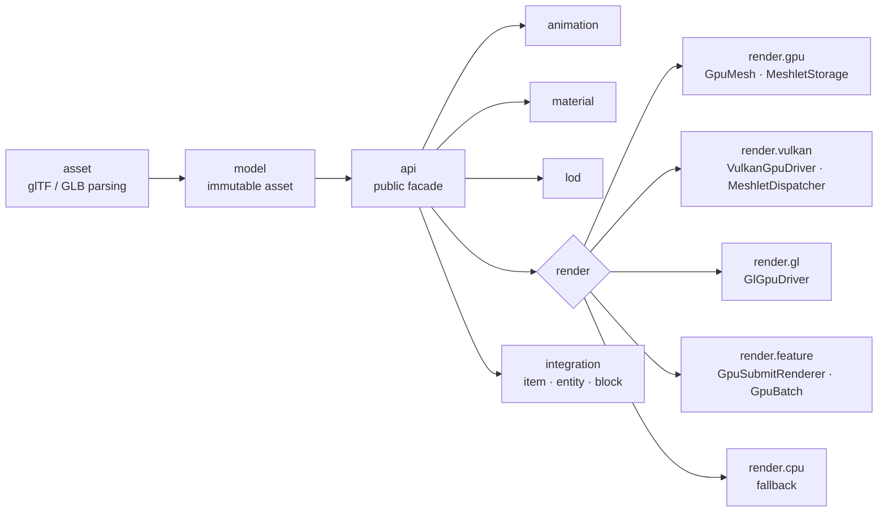

<div align="center">


**High-performance glTF 2.0 rendering for Minecraft · Fabric**

<br/>

<a href="https://www.khronos.org/gltf/"></a>&nbsp;&nbsp;&nbsp;&nbsp;
<a href="https://www.vulkan.org"></a>&nbsp;&nbsp;&nbsp;&nbsp;
<a href="https://www.opengl.org"></a>&nbsp;&nbsp;&nbsp;&nbsp;
<a href="https://www.minecraft.net"></a>&nbsp;&nbsp;&nbsp;&nbsp;
<a href="https://fabricmc.net"></a>&nbsp;&nbsp;&nbsp;&nbsp;
<a href="https://irisshaders.dev"></a>&nbsp;&nbsp;&nbsp;&nbsp;
<a href="https://kotlinlang.org"></a>

<br/>

**English** · [简体中文](README.zh-CN.md)

</div>

---

> [!NOTE]
> **libgltf** is a rendering *library*, not a content mod. Other mods call its API to attach animated, PBR-textured glTF 2.0 models to **items, entities and block entities**, rendered natively inside Minecraft's modern Vulkan / OpenGL pipeline.

## Highlights

| Feature | Detail |
|---|---|
| **glTF 2.0 / GLB** | Meshes, node hierarchies, skins, PBR materials, `OPAQUE` / `MASK` / `BLEND` |
| **Mesh shaders** | Vulkan `VK_NV_mesh_shader` / `VK_EXT_mesh_shader` and OpenGL `GL_EXT_mesh_shader` / `GL_NV_mesh_shader` task/mesh pipelines |
| **Compact meshlets** | 16-byte per-meshlet vertices (quantized position, oct16 normal, fp16 UV, 8-bit color) with sequential reads |
| **Batched dispatch** | NV path processes 4 meshlets per workgroup, cutting group count 3-4x |
| **Three-level culling** | Frustum sphere, tight-cone backface, previous-frame depth occlusion (device-space comparison) |
| **GPU-driven fallback** | Compute-shader culling → `vkCmdDrawIndexedIndirectCount` on devices without mesh shaders |
| **Descriptor caching** | Storage descriptor sets cached by buffer identity; zero updates per frame in steady state |
| **Instancing & skinning** | Bone palettes streamed via triple-buffered ring buffers, zero cross-frame races |
| **Animation** | Clip playback, blending, parameterized state machines with conditions and transitions |
| **LOD** | meshoptimizer-generated LOD chains with configurable selection policies |
| **True transparency** | Per-face sorting for `BLEND` materials |
| **Iris compatible** | Dedicated OpenGL pipeline mapping when shader packs are enabled |
| **Extensions** | `KHR_materials_variants`, `KHR_animation_pointer`, `EXT_meshopt_compression`, scenes / cameras / lights |
| **Auto device profile** | Picks the highest-performance path per vendor; overridable via `config/libgltf.properties` |

> [!TIP]
> No capable GPU? libgltf probes device capabilities at startup and falls back **mesh shader → indirect → direct → CPU** automatically.

## Quick start

```kotlin
val api: GltfApi = LibGltf.api

val asset = (api.load(Path.of("models/drone.glb")) as GltfLoadSuccess).asset
val instance = api.createInstance(api.upload(asset))

instance.animator.play("Start_Liftoff")
instance.setPosition(0f, 64f, 0f)
api.register(instance)
```

Attach to game objects with one line:

```kotlin
GltfRenderers.item(instance)
GltfRenderers.block(instance)
GltfRenderers.entity(context, provider)
GltfRenderers.blockEntity(provider)
```

<details>
<summary><b>Per-instance control — render mode, LOD, material remapping</b></summary>

```kotlin
instance.renderMode = GltfRenderMode.GPU_PREFERRED
instance.lodPolicy = LodPolicy.DEFAULT
instance.remapMaterial("Body", "BodyDamaged")
instance.setMaterial(0, MaterialOverride(...))
instance.automaticAnimation = false
```

</details>

## Configuration

On first launch libgltf generates `config/libgltf.properties`:

```properties
meshShader=auto        # auto | on | off
meshBatchSize=4        # 1-4, meshlets per NV workgroup
occlusionCulling=false # previous-frame depth occlusion
instanceCulling=true
meshletCulling=true
groupLimit=65535
```

The device profile automatically enables the best path; the config overrides it.

## Architecture


```mermaid
flowchart LR
    A["asset<br/>glTF / GLB parsing"] --> M["model<br/>immutable asset"]
    M --> API["api<br/>public facade"]
    API --> AN["animation"]
    API --> MAT["material"]
    API --> LOD["lod"]
    API --> R{"render"}
    R --> GPU["render.gpu<br/>GpuMesh · MeshletStorage"]
    R --> VK["render.vulkan<br/>VulkanGpuDriver · MeshletDispatcher"]
    R --> GL["render.gl<br/>GlGpuDriver"]
    R --> F["render.feature<br/>GpuSubmitRenderer · GpuBatch"]
    R --> CPU["render.cpu<br/>fallback"]
    API --> INT["integration<br/>item · entity · block"]
```

<details>
<summary><b>Package layout</b></summary>

| Package | Responsibility |
|---|---|
| `api` | Public facade: loading, handles, instances, render mode |
| `asset` / `model` | glTF / GLB parsing and immutable asset model |
| `material` / `texture` | PBR materials, overrides, texture generation |
| `animation` / `lod` | Animation state machines, LOD generation and selection |
| `render.gpu` | GPU resources, meshlet storage, capability probing |
| `render.vulkan` / `render.gl` | Mesh and indirect drawing for both backends |
| `render.feature` | Frame submission, batching, FeatureRenderer integration |
| `integration` | Item / entity / block-entity renderers |

</details>

## Building

```powershell
.\gradlew.bat build
```

Output → `build/libs/libgltf-0.10-fabric-26.3-snapshot-7.jar`

> [!IMPORTANT]
> Requires Minecraft **26.3-snapshot-7**, Fabric Loader **0.19.3+**, Fabric API, Fabric Language Kotlin and Java **25**.
> The mesh-shader path needs `VK_EXT_mesh_shader` / `VK_NV_mesh_shader` (Vulkan) or `GL_EXT_mesh_shader` / `GL_NV_mesh_shader` (OpenGL).

---

<div align="center">

MIT © Micheanl Chen

</div>
