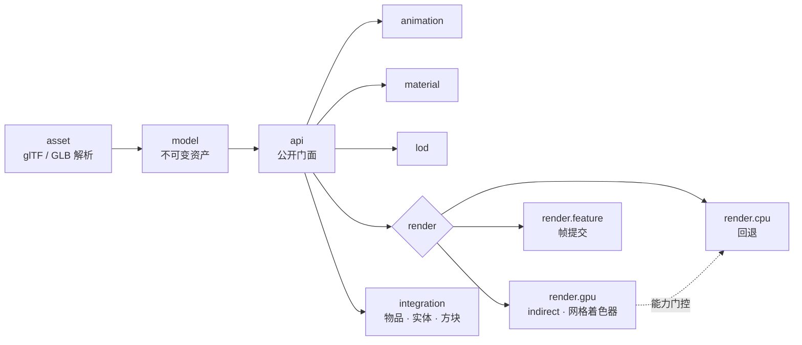

<div align="center">


**为 Minecraft 打造的高性能 glTF 2.0 模型加载与渲染引擎 · Fabric**

<br/>

<a href="https://www.khronos.org/gltf/"></a>&nbsp;&nbsp;&nbsp;&nbsp;
<a href="https://www.vulkan.org"></a>&nbsp;&nbsp;&nbsp;&nbsp;
<a href="https://www.opengl.org"></a>&nbsp;&nbsp;&nbsp;&nbsp;
<a href="https://www.minecraft.net"></a>&nbsp;&nbsp;&nbsp;&nbsp;
<a href="https://fabricmc.net"></a>&nbsp;&nbsp;&nbsp;&nbsp;
<a href="https://irisshaders.dev"></a>&nbsp;&nbsp;&nbsp;&nbsp;
<a href="https://kotlinlang.org"></a>

<br/>

[English](README.md) · **简体中文**

</div>

---

> [!NOTE]
> **libgltf** 是一个渲染*库*，不是内容模组。其他模组通过 API 即可为**物品、实体、方块实体**挂载带动画与 PBR 材质的 glTF 2.0 模型，并在 Minecraft 现代 Vulkan / OpenGL 管线中原生渲染。

## 亮点

| 特性 | 说明 |
|---|---|
| **glTF 2.0 / GLB** | 网格、节点层级、蒙皮、PBR 材质，完整支持 `OPAQUE` / `MASK` / `BLEND` |
| **GPU 驱动（Vulkan）** | compute shader 实例与 meshlet 视锥剔除 → `vkCmdDrawIndexedIndirectCount` |
| **网格着色器** | Vulkan `VK_EXT_mesh_shader` 与 OpenGL `GL_EXT_mesh_shader` / `GL_NV_mesh_shader` task/mesh 管线，自动逐级回退 |
| **实例化与蒙皮** | 骨骼调色板经三缓冲 `MappableRingBuffer` 流式上传，无跨帧竞争 |
| **动画系统** | 剪辑播放、混合，带参数、条件与过渡的动画状态机 |
| **LOD** | meshoptimizer 生成的 LOD 链，选择策略可配置 |
| **正确透明** | 基于 Mojang `VertexSorting` 的 `BLEND` 材质逐面排序 |
| **Iris 兼容** | 开启光影时使用专用 OpenGL 管线映射 |
| **KHR_materials_variants** | 逐图元材质变体映射，运行时切换 |
| **EXT_mesh_gpu_instancing** | 节点级实例变换，CPU / GPU / glint 三路径 |
| **KHR_animation_pointer** | 材质 UV 与颜色因子动画，支持交叉淡入淡出 |
| **EXT_meshopt_compression** | 顶点 / 索引解压与回退 |
| **场景 / 相机 / 灯光** | 多场景切换及相机、点光源数据 |
| **厂商画像** | NVIDIA / AMD / Intel 的 mesh workgroup、剔除与 task 数量调优 |

> [!TIP]
> 设备不给力？没关系。libgltf 启动时探测设备能力，透明地按 **网格着色器 → indirect → direct → CPU** 逐级回退，同一份代码到处能跑。

## 快速开始

```kotlin
val api: GltfApi = LibGltf.api

val asset = (api.load(Path.of("models/drone.glb")) as GltfLoadSuccess).asset
val instance = api.createInstance(api.upload(asset))

instance.animator.play("Start_Liftoff")
instance.setPosition(0f, 64f, 0f)
api.register(instance)
```

一行挂载到游戏对象：

```kotlin
GltfRenderers.item(instance)
GltfRenderers.block(instance)
GltfRenderers.entity(context, provider)
GltfRenderers.blockEntity(provider)
```

<details>
<summary><b>实例级控制 — 渲染模式、LOD、材质重映射</b></summary>

```kotlin
instance.renderMode = GltfRenderMode.GPU_PREFERRED
instance.lodPolicy = LodPolicy.DEFAULT
instance.remapMaterial("Body", "BodyDamaged")
instance.setMaterial(0, MaterialOverride(...))
instance.automaticAnimation = false
```

</details>

## 架构



<details>
<summary><b>包结构</b></summary>

| 包 | 职责 |
|---|---|
| `api` | 公开门面：加载、句柄、实例、渲染模式 |
| `asset` | glTF / GLB 解析与缓冲解码 |
| `model` | 不可变资产模型（节点、网格、蒙皮） |
| `material` | PBR 材质与实例级覆盖 |
| `animation` | 播放器、控制器、状态机 |
| `lod` | LOD 生成与选择 |
| `render.cpu` / `render.gpu` / `render.feature` | CPU 回退、GPU 资源、帧提交 |
| `integration` | 物品 / 实体 / 方块实体渲染器 |
| `mixin` | Vulkan 与 Iris 集成所需的最小 Java Mixin |

</details>

## 调试

无需写代码即可加载外部模型并查看渲染状态：

```
/libgltf_debug load <path>
/libgltf_debug mode auto|gpu|cpu
/libgltf_debug lod <n>
/libgltf_debug anim [<index>|stop]
/libgltf_debug variant <index>
/libgltf_debug scene <index>
/libgltf_debug bones on|off
/libgltf_debug mesh on|off|auto
```

按 F3 可查看后端、厂商、mesh/OIT 状态、批次统计、LOD、动画、UV、变体、场景与骨骼状态。

## 构建

```powershell
.\gradlew.bat build
```

产物 → `build/libs/libgltf-0.01-fabric.jar`

> [!IMPORTANT]
> 需要 Minecraft **26.3-snapshot-7**、Fabric Loader **0.19.3+**、Fabric API、Fabric Language Kotlin 与 Java **25**。
> 网格着色器路径需要 `VK_EXT_mesh_shader`（Vulkan）或 `GL_EXT_mesh_shader` / `GL_NV_mesh_shader`（OpenGL）。

---

<div align="center">

MIT © Micheanl Chen

</div>
