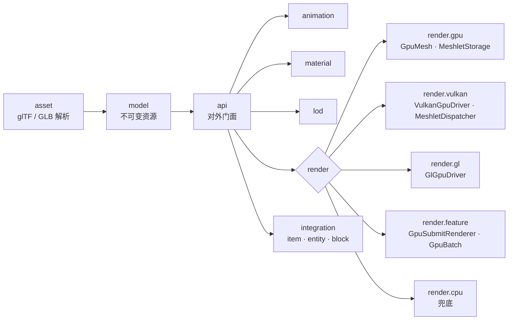

<div align="center">


**为 Minecraft 打造的高性能 glTF 2.0 渲染库 · Fabric**

<br/>

<a href="https://www.khronos.org/gltf/"></a>&nbsp;&nbsp;&nbsp;&nbsp;
<a href="https://www.vulkan.org"></a>&nbsp;&nbsp;&nbsp;&nbsp;
<a href="https://www.opengl.org"></a>&nbsp;&nbsp;&nbsp;&nbsp;
<a href="https://www.minecraft.net"></a>&nbsp;&nbsp;&nbsp;&nbsp;
<a href="https://fabricmc.net"></a>&nbsp;&nbsp;&nbsp;&nbsp;
<a href="https://irisshaders.dev"></a>&nbsp;&nbsp;&nbsp;&nbsp;
<a href="https://kotlinlang.org"></a>

<br/>

[English](README.md) · **简体中文**

</div>

---

> [!NOTE]
> **libgltf** 是一个渲染**库**，不是内容模组。其他模组通过它的 API 把带动画、PBR 材质的 glTF 2.0 模型挂到**物品、实体、方块实体**上，并原生跑在 Minecraft 的 Vulkan / OpenGL 渲染管线里。

## 特性

| 特性 | 说明 |
|---|---|
| **glTF 2.0 / GLB** | 网格、节点层级、蒙皮、PBR 材质，`OPAQUE` / `MASK` / `BLEND` |
| **Mesh shader** | Vulkan `VK_NV_mesh_shader` / `VK_EXT_mesh_shader` 与 OpenGL `GL_EXT_mesh_shader` / `GL_NV_mesh_shader` 双后端 |
| **紧凑 meshlet** | 每顶点 16 字节（量化位置、oct16 法线、fp16 UV、8 位颜色），顺序读取 |
| **批量分发** | NV 路径每组处理 4 个 meshlet，组数降 3-4 倍 |
| **三级剔除** | 视锥球体、紧致锥背面、上一帧深度遮挡（设备深度空间比较） |
| **GPU 驱动兜底** | 无 mesh shader 设备自动降级为计算剔除 → 间接绘制 |
| **描述符缓存** | 按缓冲身份跨帧缓存，稳态每帧零更新 |
| **实例化与蒙皮** | 骨骼调色板经三缓冲环形缓冲流式上传，无跨帧竞争 |
| **动画** | 片段播放、混合、带条件与转换的参数化状态机 |
| **LOD** | meshoptimizer 生成的 LOD 链与可配置选择策略 |
| **真透明** | `BLEND` 材质逐面排序 |
| **Iris 兼容** | 启用光影包时映射专用 OpenGL 管线 |
| **扩展支持** | `KHR_materials_variants`、`KHR_animation_pointer`、`EXT_meshopt_compression`、场景/相机/光源 |
| **按设备自动优化** | 自动选择最高性能路径，可用 `config/libgltf.properties` 覆盖 |

> [!TIP]
> 设备不支持 mesh shader？启动时自动探测能力，按 **mesh shader → 间接 → 直绘 → CPU** 逐级降级，同一套代码到处可跑。

## 快速开始

```kotlin
val api: GltfApi = LibGltf.api

val asset = (api.load(Path.of("models/drone.glb")) as GltfLoadSuccess).asset
val instance = api.createInstance(api.upload(asset))

instance.animator.play("Start_Liftoff")
instance.setPosition(0f, 64f, 0f)
api.register(instance)
```

一行挂到游戏对象上：

```kotlin
GltfRenderers.item(instance)
GltfRenderers.block(instance)
GltfRenderers.entity(context, provider)
GltfRenderers.blockEntity(provider)
```

<details>
<summary><b>实例级控制 — 渲染模式、LOD、材质重映射</b></summary>

```kotlin
instance.renderMode = GltfRenderMode.GPU_PREFERRED
instance.lodPolicy = LodPolicy.DEFAULT
instance.remapMaterial("Body", "BodyDamaged")
instance.setMaterial(0, MaterialOverride(...))
instance.automaticAnimation = false
```

</details>

## 通过 Maven Central 使用

发布坐标：`io.github.micheanl:libgltf:0.10-fabric-26.3-snapshot-7`

Gradle（Kotlin DSL）：

```kotlin
modImplementation("io.github.micheanl:libgltf:0.10-fabric-26.3-snapshot-7")
```

Gradle（Groovy DSL）：

```groovy
modImplementation 'io.github.micheanl:libgltf:0.10-fabric-26.3-snapshot-7'
```

Maven：

```xml
<dependency>
    <groupId>io.github.micheanl</groupId>
    <artifactId>libgltf</artifactId>
    <version>0.10-fabric-26.3-snapshot-7</version>
</dependency>
```

> [!NOTE]
> jar 已内置 meshoptimizer 原生运行库，在 Fabric Loom 项目里用 `modImplementation` 声明即可；每次发布也会同步推送 GitHub Packages 镜像。

## 配置

首次启动自动生成 `config/libgltf.properties`：

```properties
meshShader=auto        # auto | on | off
meshBatchSize=4        # 1-4，NV 每组处理的 meshlet 数
occlusionCulling=false # 上一帧深度遮挡
instanceCulling=true
meshletCulling=true
groupLimit=65535
```

设备画像会自动开启最高性能路径，配置文件可覆盖。

## 架构



<details>
<summary><b>包结构</b></summary>

| 包 | 职责 |
|---|---|
| `api` | 对外门面：加载、句柄、实例、渲染模式 |
| `asset` / `model` | glTF / GLB 解析与不可变资源模型 |
| `material` / `texture` | PBR 材质、覆盖、贴图生成 |
| `animation` / `lod` | 动画状态机、LOD 生成与选择 |
| `render.gpu` | GPU 资源、meshlet 存储、能力探测 |
| `render.vulkan` / `render.gl` | 双后端的 mesh 与间接绘制 |
| `render.feature` | 帧提交、批处理、FeatureRenderer 接入 |
| `integration` | 物品 / 实体 / 方块实体渲染器 |

</details>

## 构建

```powershell
.\gradlew.bat build
```

产物 → `build/libs/libgltf-0.10-fabric-26.3-snapshot-7.jar`

> [!IMPORTANT]
> 需要 Minecraft **26.3-snapshot-7**、Fabric Loader **0.19.3+**、Fabric API、Fabric Language Kotlin 与 Java **25**。
> mesh shader 路径需要 `VK_EXT_mesh_shader` / `VK_NV_mesh_shader`（Vulkan）或 `GL_EXT_mesh_shader` / `GL_NV_mesh_shader`（OpenGL）。

<div align="center">

MIT © Micheanl Chen

</div>
